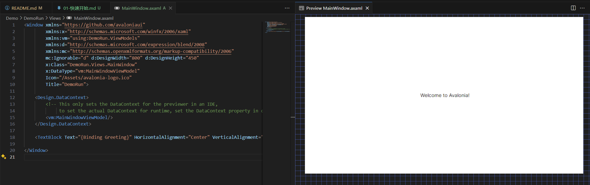

# 01 - 快速开始

## 简述 Avalonia

Avalonia 是一个跨平台的 UI 框架，可以用于构建 Windows、Linux 和 macOS 上的应用程序。它基于 .net core 编写了一个新的 UI 框架，目标是提供一个现代的 XAML 和 .NET API，以便在所有支持的平台上构建应用程序。

对于 WPF 开发者来说，想要实现跨平台应用开发，Avalonia 是一个很好的选择，因为它提供了类似 WPF 的 API 和 XAML 语法，所以可以很容易地迁移现有的 WPF 项目到 Avalonia。

## 创建 Avalonia + ReactiveUI 项目

1. 安装模板 `dotnet new -i Avalonia.Templates`
2. 创建项目 `dotnet new avalonia.reactiveui -n AvaloniaDemo`
3. 运行项目 `dotnet run`
4. 打包项目 `dotnet publish -r win-x64 -c Release /p:PublishSingleFile=true`

## 项目结构

- `App.axaml` - UI 线程的入口点
- `Program.cs` - 程序入口点，这里会构造一个 `App` 实例并启动
- `ViewModels` - 视图模型
- `Views` - 视图
- `Models` - 模型
- `Assets` - 图片、字体等资源

### App.axaml.cs

```csharp
public partial class App : Application {
    public override void Initialize() {
        AvaloniaXamlLoader.Load(this);
    }

    public override void OnFrameworkInitializationCompleted() {
        if (ApplicationLifetime is IClassicDesktopStyleApplicationLifetime desktop) {
            desktop.MainWindow = new MainWindow {
                DataContext = new MainWindowViewModel(),
            };
        }

        base.OnFrameworkInitializationCompleted();
    }
}
```

> 会发现这段代码和 WPF 的 App.xaml.cs 有很多相似之处，但是 `Application` 是 `Avalonia` 中实现的实现的一个UI类，而并非 WPF 中的 `Application` 。
> 
> 这里在 `Initialize` 方法中加载前端 axaml 文件，`OnFrameworkInitializationCompleted` 方法中构造主窗口。

### Program.cs

```csharp
sealed class Program {
    // Initialization code. Don't use any Avalonia, third-party APIs or any
    // SynchronizationContext-reliant code before AppMain is called: things aren't initialized
    // yet and stuff might break.
    [STAThread]
    public static void Main(string[] args) => BuildAvaloniaApp()
        .StartWithClassicDesktopLifetime(args);

    // Avalonia configuration, don't remove; also used by visual designer.
    public static AppBuilder BuildAvaloniaApp()
        => AppBuilder.Configure<App>()
            .UsePlatformDetect()
            .WithInterFont()
            .LogToTrace()
            .UseReactiveUI();
}
```

> `Program.cs` 是程序的入口点，这里会构造一个 `App` 实例并启动。实际上这里是一个静态类，`Main` 方法中调用 `BuildAvaloniaApp` 方法构造 `App` 实例并启动。`StartWithClassicDesktopLifetime` 方法会启动一个经典的桌面应用程序生命周期，当生命周期初始化完成后，会调用 `App` 类的 `OnFrameworkInitializationCompleted` 方法，即 `App.axaml.cs` 中的 `OnFrameworkInitializationCompleted` 方法，设置一个主窗口。
>
> `BuildAvaloniaApp` 方法中配置了 `App` 实例，使用了 `UsePlatformDetect` 方法检测平台，`WithInterFont` 方法设置了默认字体，`LogToTrace` 方法启用了日志跟踪，`UseReactiveUI` 方法启用了 `ReactiveUI`。


当然，Avalonia 的社区已经有了不少其他的 MVVM 框架，例如 Prism，CommunityToolkit.Mvvm 等，这里只是简单介绍了一下 Avalonia + ReactiveUI 的项目结构，可以根据自己的需求选择合适的框架，这里只是为了学习 Avalonia 和 ReactiveUI 的基础知识，所以选择了 ReactiveUI。

## 预览插件

在 vscode、rider、vs 中都有相应的插件可以预览 axaml 文件，这样可以更方便地进行 UI 开发。如下图所示



但是需要手动指定设计时的 DataContext，否则无法预览。

```xml
<Design.DataContext>
    <!-- This only sets the DataContext for the previewer in an IDE, 
         to set the actual DataContext for runtime, set the DataContext 
         property in code (look at App.axaml.cs) -->
    <vm:MainWindowViewModel/>
</Design.DataContext>
```

## 参考

1. [Avalonia 官方文档](https://docs.avaloniaui.net/zh-Hans/docs/get-started/)