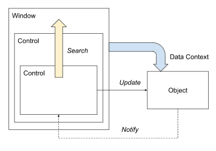

# 数据绑定

Avalonia使用数据绑定将数据从应用程序对象传递到UI控件，根据用户输入更改应用程序对象中的数据，并在响应用户命令时对应用程序对象进行操作。在这种安排中，控件是绑定目标，而对象是数据源。

Avalonia运行数据绑定系统来完成大部分上述活动，而无需添加大量额外的代码，只需在XAML中声明简单的映射即可。

数据绑定映射是在Avalonia控件的属性和应用程序对象的属性之间使用XML定义的。一般来说，语法如下：

```xml
<SomeControl Attribute="{Binding PropertyName}" />
```

这些映射可以是双向的：即绑定应用程序对象的属性的更改将反映在控件中，而控件中的更改（无论是由用户引起的还是其他原因）都将应用于底层对象。双向绑定的一个示例是将文本输入绑定到对象的字符串属性。XML可能如下所示：

```xml
<TextBox Text="{Binding FirstName}" />
```

如果用户在文本框中编辑文本，则底层对象的FirstName属性将自动更新。另一方面，如果底层对象的FirstName属性更改，则文本框中可见的文本将更新。

绑定可以是单向的：即绑定应用程序对象的属性的更改将反映在控件中，但用户不能更改控件的值。这样的一个例子是文本块控件，它是只读的。

```xml
<TextBlock Text="{Binding StatusMessage}" />
```

绑定与MVVM（Model-View-ViewModel）架构模式一起使用，这是使用Avalonia UI的主要方式之一。

## DataContext

当Avalonia执行数据绑定时，它必须定位要绑定的应用程序对象。这个位置由 **DataContext** 表示。

在绑定时，Avalonia会从逻辑控件树中进行分层搜索，从定义绑定的控件开始，直到找到要使用的数据上下文，这意味着在窗口中定义的控件可以使用窗口的数据上下文；



或者（如上所示），在窗口中的控件中定义的控件可以使用窗口的数据上下文。

### 示例

使用 Avalonia MVVM Application 模板创建一个新项目，可以看到窗口的数据上下文是如何设置的。

**App.axaml.cs**

```csharp
public override void OnFrameworkInitializationCompleted()
{
    if (ApplicationLifetime is IClassicDesktopStyleApplicationLifetime desktop)
    {
        desktop.MainWindow = new MainWindow
        {
            DataContext = new MainWindowViewModel(),
        };
    }

    base.OnFrameworkInitializationCompleted();
}
```

**MainWindowViewModel.cs**

```csharp
public class MainWindowViewModel : ViewModelBase
{
    public string Greeting => "Welcome to Avalonia!";
}
```

**MainWindow.axaml**

```xml
...
<TextBlock Text="{Binding Greeting}" />
...
```

项目运行时，数据绑定器从文本块开始向上搜索逻辑控件树，找到在主窗口级别设置的数据上下文。因此，绑定的文本显示为：Welcome to Avalonia!。

### 设计时DataContext

在首次编译此项目后，预览窗格也显示具体的数据。这是因为Avalonia支持设计时数据上下文，这使得在设计时可以看到绑定的数据。

```xml
<Design.DataContext>
    <vm:MainWindowViewModel/>
</Design.DataContext>
```

## 绑定到命令

在Avalonia中，可以使用XAML或代码定义数据绑定。要在XAML中定义数据绑定，可以使用数据绑定标记扩展，其语法如下所述。

### 数据绑定标记扩展

数据绑定标记扩展使用关键字Binding，结合定义数据源和其他选项的参数。标记扩展的格式如下：

```xml
<SomeControl SomeProperty="{Binding Path, Mode=ModeValue, StringFormat=Pattern}" />
```

| 参数           | 描述                           |
| -------------- | ------------------------------ |
| Path           | 数据绑定路径。                 |
| Mode           | 绑定模式之一，见下文。         |
| StringFormat   | 显示值的格式化模式。           |
| ElementName    | 可以通过在路径中使用＃来缩短。 |
| Converter      | 用于转换值的函数。             |
| RelativeSource | 在视觉树中工作，而不是逻辑树。 |

### 数据绑定路径

第一个参数通常是数据源的路径。数据源是Avalonia在执行数据绑定时找到的数据上下文中的对象。

在这里，不需要使用参数名Path。因此，以下绑定是等效的：

```xml
<TextBlock Text="{Binding Name}"/>
<TextBlock Text="{Binding Path=Name}"/>
```

绑定路径可以是单个属性，也可以是属性链。例如，如果数据源有一个Student属性，该属性返回的对象具有一个Name属性，可以使用以下语法绑定到学生姓名：

```xml
<TextBlock Text="{Binding Student.Name}"/>
```

如果数据源有一个数组或列表（带有索引器），则可以将索引添加到绑定路径中，如下所示：

```xml
<TextBlock Text="{Binding Students[0].Name}"/>
```

#### 空的数据绑定

可以指定没有路径的数据绑定。这将绑定到控件本身的数据上下文（绑定定义的位置）。以下两种语法是等效的：

```xml
<TextBlock Text="{Binding}"/>
<TextBlock Text="{Binding .}"/>
```

### 绑定模式

绑定模式定义了数据绑定的行为。以下是可用的绑定模式：

- **OneWay**：默认值。数据源的更改将反映在控件中，但控件中的更改不会反映在数据源中。
- **OneWayToSource**：控件中的更改将反映在数据源中，但数据源的更改不会反映在控件中。
- **TwoWay**：数据源和控件之间的更改是双向的。
- **OneTime**：数据源的值将绑定到控件，但不会更新。
- **Default**：使用控件的默认绑定模式。

如果未指定模式，则将始终使用默认模式。对于不因用户交互而改变值的控件属性，默认模式通常是OneWay。对于因用户输入而改变值的控件属性，默认模式通常是TwoWay。

例如，TextBlock.Text属性的默认模式是OneWay，而TextBox.Text属性的默认模式是TwoWay。

### 转换绑定的值

#### 字符串格式化

可以对绑定应用模式来定义要如何显示该值。这里有几种语法：

模式索引从零开始，必须始终位于花括号内。当花括号位于模式的开头时，即使也在单引号内，它们也必须被转义。

这可以通过在模式前面添加额外的一对花括号或使用反斜杠转义花括号来实现。


```xml
<TextBlock Text="{Binding FloatProperty, StringFormat={}{0:0.0}}" />
<TextBlock Text="{Binding FloatValue, StringFormat=\{0:0.0\}}" />
```

但是，如果模式不以零开头，则不需要转义。

此外，如果模式中有空格，则必须用单引号括起来。例如：

```xml
<TextBlock Text="{Binding Animals.Count, StringFormat='I have {0} animals.'}" />
```

请注意，这意味着如果模式以绑定的值开头，则需要转义。例如：

```xml
<TextBlock Text="{Binding Animals.Count, StringFormat='{}{0} animals live in the farm.'}" />
```

#### 内置转换器

Avalonia 拥有许多内置的数据绑定转换器，包括：

- 字符串格式化转换器
- 空值测试转换器
- 布尔操作转换器

#### 自定义转换器

如果内置转换器都不满足的要求，可以实现自定义转换器。


## 编译绑定

在XAML中定义的绑定使用反射来查找和访问的ViewModel中请求的属性。在Avalonia中，可以使用编译绑定，它有一些好处：

1. 如果使用编译绑定，并且找不到要绑定的属性，将获得一个编译时错误。因此，将获得更好的调试体验。
2. 已知反射较慢。因此，使用编译绑定可以提高应用程序的性能。

### 启用编译绑定

#### 全局启用

如果希望应用程序默认情况下全局使用编译绑定，可以将以下内容添加到的项目文件中：

```xml
<AvaloniaUseCompiledBindingsByDefault>true</AvaloniaUseCompiledBindingsByDefault>
```

仍然需要为想要绑定的对象提供x:DataType，但是不需要为每个UserControl或Window设置x:CompileBindings="True|False"。

#### 在每个UserControl或Window中启用和禁用

要启用编译绑定，需要首先定义要绑定的对象的`DataType`。在`DataTemplates`中，有一个DataType属性，对于所有其他元素，可以通过`x:DataType`来设置它。最可能在根节点中设置`x:DataType`，例如在Window或UserControl中。还可以直接在Binding中指定DataType。

现在，可以通过设置x:CompileBindings="True|False"来启用或禁用编译绑定。所有子节点都将继承此属性，因此可以在根节点中启用它，并在需要时禁用特定子节点。

```xml
<!-- 设置DataType并启用编译绑定 -->
<UserControl ...
             x:DataType="vm:MyViewModel"
             x:CompileBindings="True">
    <StackPanel>
        <TextBlock Text="Last name:" />
        <TextBox Text="{Binding LastName}" />
        <TextBlock Text="Given name:" />
        <TextBox Text="{Binding GivenName}" />
        <TextBlock Text="E-Mail:" />
        <!-- 在Binding标记中设置DataType -->
        <TextBox Text="{Binding MailAddress, DataType={x:Type vm:MyViewModel}}" />

        <Button Content="Send an E-Mail"
                Command="{Binding SendEmailCommand}" />
    </StackPanel>
</UserControl>
```

### CompiledBinding

如果不希望为所有子节点启用编译绑定，还可以使用`CompiledBinding`。仍然需要定义DataType，但可以省略`x:CompileBindings="True"`。

### ReflectionBinding

如果已在根节点启用了编译绑定，并且要么不想在某个位置使用编译绑定，要么遇到了已知的限制，则可以使用ReflectionBinding。

```xml
<!-- 设置DataType -->
<UserControl xmlns="https://github.com/avaloniaui"
             xmlns:x="http://schemas.microsoft.com/winfx/2006/xaml"
             xmlns:vm="using:MyApp.ViewModels"
             x:DataType="vm:MyViewModel"
             x:CompileBindings="True">
    <StackPanel>
        <TextBlock Text="Last name:" />
        <TextBox Text="{Binding LastName}" />
        <TextBlock Text="Given name:" />
        <TextBox Text="{Binding GivenName}" />
        <TextBlock Text="E-Mail:" />
        <TextBox Text="{Binding MailAddress}" />

        <!-- 我们使用ReflectionBinding -->
        <Button Content="Send an E-Mail"
                Command="{ReflectionBinding SendEmailCommand}" />
    </StackPanel>
</UserControl>
```

### 类型转换

在某些情况下，绑定表达式的目标类型无法自动计算。在这种情况下，必须在绑定表达式中提供一个明确的类型转换。

```xml
<ItemsRepeater ItemsSource="{Binding MyItems}">
<ItemsRepeater.ItemTemplate>
    <DataTemplate>
    <StackPanel Orientation="Horizontal">
        <TextBlock Text="{Binding DisplayName}"/>
        <Grid>
        <Button Command="{Binding $parent[ItemsRepeater].((vm:MyUserControlViewModel)DataContext).DoItCommand}"
                CommandParameter="{Binding ItemId}"/>
        </Grid>
    </StackPanel>
    </DataTemplate>
</ItemsRepeater.ItemTemplate>
</ItemsRepeater>
```

在这种情况下，按钮命令将绑定到父级`DataContext`，而不是绑定到项目的DataContext。单个项目将使用绑定到项目的DataContext的CommandParameter进行标识。因此，必须通过强制转换表达式((vm:MyUserControlViewModel)DataContext)来指定父级DataContext的类型。

> 而对于 WPF 来说，这种类型转换是不需要的，因为 WPF 会自动计算类型，但是如果与预期的不符会产生很多麻烦

