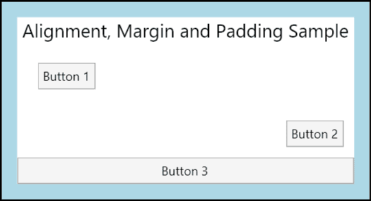
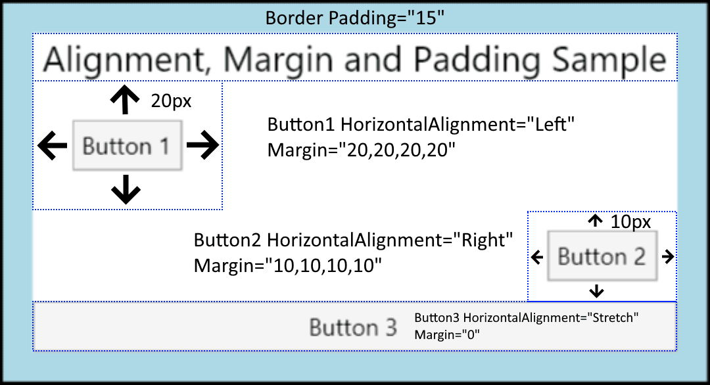

 布局

# 面板

Avalonia 包含一组派生自 Panel 的元素。这些 Panel 元素可实现许多复杂的布局。例如，可以使用 StackPanel 元素轻松地堆叠元素，而使用 Canvas 则可以实现更复杂和自由流动的布局。

| 名称          | 描述                                                                                                                                          |
| ------------- | --------------------------------------------------------------------------------------------------------------------------------------------- |
| Panel         | 将所有子元素布局以填充 Panel 的边界                                                                                                           |
| Canvas        | 定义一个区域，可以在其中使用相对于 Canvas 区域的坐标明确定位子元素                                                                            |
| DockPanel     | 定义一个区域，其中可以相对于彼此将子元素水平或垂直地排列                                                                                      |
| Grid          | 定义由列和行组成的灵活网格区域                                                                                                                |
| RelativePanel | 将子元素相对于其他元素或面板本身排列                                                                                                          |
| StackPanel    | 将子元素排列成一行，可以是水平或垂直方向                                                                                                      |
| WrapPanel     | 将子元素按从左到右的顺序放置，当内容到达容器框的边缘时，将在下一行中断。后续排序顺序是顺序从上到下或从右到左，这取决于 Orientation 属性的值。 |

在 WPF 中，Panel 是一个抽象类，通常使用没有行/列的 Grid 来布局多个控件以填充可用空间。在 Avalonia 中，Panel 是一个可用的控件，其布局行为与没有行/列的 Grid 相同，但运行时占用更少的资源。

## 元素边界框

在考虑 Avalonia 中的布局时，了解包围所有元素的边界框很重要。布局系统处理的每个 Control 可以看作是一个矩形，该矩形被插入布局。Bounds 属性返回元素布局分配的边界。矩形的大小通过计算可用的屏幕空间、任何约束的大小、布局特定属性（如 margin 和 padding）以及父 Panel 元素的个体行为来确定。处理这些数据，布局系统能够计算特定 Panel 的所有子元素的位置。重要的是要记住，定义在父元素上的大小特性，例如 Border 上的特性，会影响其子元素。

## 布局系统

简单来说，布局是一种递归系统，导致元素被大小化、定位和绘制。更具体地说，布局描述了对 Panel 元素的 Children 集合的成员进行测量和排列的过程。布局是一个密集的过程。Children 集合越大，必须进行的计算越多。还可以根据拥有集合的 Panel 元素定义的布局行为引入复杂性。一个相对简单的 Panel，例如 Canvas，可以比一个更复杂的 Panel，例如 Grid，具有更好的性能。

每次子控件更改其位置时，它都有可能触发布局系统的新传递。因此，了解可以调用布局系统的事件很重要，因为不必要的调用可能会导致应用程序性能下降。下面描述了在调用布局系统时发生的过程。

1. 子 UIElement 通过首先测量其核心属性来开始布局过程。
2. 评估在 Control 上定义的大小属性，例如 Width、Height 和 Margin。
3. 应用 Panel 特定的逻辑，例如 Dock 方向或堆叠的 Orientation。
4. 在所有子元素进行测量后，进行内容的排列。
5. 在屏幕上绘制 Children 集合。
6. 如果向集合中添加了其他 Children，则再次调用此过程。

此过程及其调用方式在以下部分中有更详细的定义。

## 测量和排列子元素

布局系统对 `Children` 集合的每个成员完成两个传递：测量传递和排列传递。每个子 `Panel` 提供其自己的 `MeasureOverride` 和 `ArrangeOverride` 方法，以实现其自己的特定布局行为。

在测量传递期间，对 `Children` 集合的每个成员进行评估。该过程从调用 `Measure` 方法开始。此方法在父 `Panel` 元素的实现中调用，不必显式调用以进行布局。

首先，评估 `Visual` 的本机大小属性，例如 `Clip` 和 `IsVisible` 。这将生成传递给 `MeasureCore` 的约束。

然后，处理影响约束值的框架属性。这些属性通常描述底层 `Control` 的大小特性，例如其 `Height`、`Width` 和 `Margin`。每个这些属性都可以改变显示元素所需的空间。然后，使用约束调用 `MeasureOverride`。

由于 `Bounds` 是计算值，因此应该注意，由于布局系统的各种操作，它可能会发生多次或增量的报告更改。布局系统可能正在为子元素计算所需的测量空间、父元素的约束等。

测量传递的最终目标是让子元素确定其 `DesiredSize`，这在 `MeasureCore` 调用期间发生。`Measure` 将 `DesiredSize` 值存储以在内容排列传递中使用。

排列传递从调用 `Arrange` 方法开始。在排列传递期间，父 `Panel` 元素生成表示子元素边界的矩形。该值传递给 `ArrangeCore` 方法进行处理。

`ArrangeCore` 方法评估子元素的 `DesiredSize`，并评估任何可能影响元素渲染大小的附加 `margin`。`ArrangeCore` 生成一个排列大小，将其作为参数传递给 `Panel` 的 `ArrangeOverride` `方法。ArrangeOverride` 生成子元素的 `finalSize`。最后，`ArrangeCore` 方法对边距和对齐等偏移属性进行最后评估，并将子元素放置在其布局插槽中。子元素不必（也经常不会）填充整个分配的空间。然后，将控件返回给父 `Panel`，布局过程完成。

## Alignment、Margin 和 Padding

### 元素定位

Avalonia定位元素有许多使用方式。然而，实现理想的布局不仅仅是选择正确的Panel元素，精确控制定位还需要理解HorizontalAlignment、Margin、Padding和VerticalAlignment属性。

下图展示了一个使用了多个定位属性的布局方案。



乍一看，本图中的Button元素可能是随机放置的。然而，它们的位置实际上是通过组合使用边距(margin)、对齐(alignment)和填充(padding)来精确控制的。

以下示例描述了如何创建上图中的布局。一个Border元素封装了一个父元素StackPanel，Padding值为15个设备独立像素。这就说明了围绕子StackPanel的狭窄的LightBlue部分。StackPanel的子元素用于说明本章节中详细介绍的每个不同的定位属性。三个Button元素用于演示Margin和HorizontalAlignment属性。

```xml
<Window xmlns="https://github.com/avaloniaui"
        xmlns:x="http://schemas.microsoft.com/winfx/2006/xaml"
        x:Class="AvaloniaApplication2.MainWindow"
        Title="AvaloniaApplication2">
  <Border Background="LightBlue"
          BorderBrush="Black"
          BorderThickness="2"
          Padding="15">
    <StackPanel Background="White"
                HorizontalAlignment="Center"
                VerticalAlignment="Top">
      <TextBlock Margin="5,0"
                 FontSize="18"
                 HorizontalAlignment="Center">
        Alignment, Margin and Padding Sample
      </TextBlock>
      <Button HorizontalAlignment="Left" Margin="20">Button 1</Button>
      <Button HorizontalAlignment="Right" Margin="10">Button 2</Button>
      <Button HorizontalAlignment="Stretch">Button 3</Button>
    </StackPanel>
  </Border>
</Window>
```

下图提供了上述示例中使用的各种定位属性的全貌图。本章节的后续部分会更详细地描述如何使用每个定位属性。



### 理解 Alignment

HorizontalAlignment和VerticalAlignment属性描述了一个子元素应该如何在父元素分配的布局空间内定位。通过一起使用这些属性，你可以精确地定位子元素。例如，DockPanel的子元素可以指定四种不同的水平对齐方式。Left、Right、Center或者Stretch（拉伸）以填补可用空间。类似的值也可用于垂直定位。

元素上明确设置的Height和Width属性的优先级高于Stretch属性。如果明确设置了Height和Width，再将HorizontalAlignment设置为Stretch，这样会忽略Stretch属性。

**HorizontalAlignment属性**

| 成员            | 描述                                                                      |
| --------------- | ------------------------------------------------------------------------- |
| Left            | 子元素与父元素分配的布局空间的左侧对齐。                                  |
| Center          | 子元素与父元素分配的布局空间的中心对齐。                                  |
| Right           | 子元素与父元素分配的布局空间的右侧对齐。                                  |
| Stretch（默认） | 子元素被拉伸以填充父元素分配的布局空间。明确的Width和Height值优先级更高。 |

**VerticalAlignment属性**

| 成员            | 描述                                                                      |
| --------------- | ------------------------------------------------------------------------- |
| Top             | 子元素与父元素分配的布局空间的顶部对齐。                                  |
| Center          | 子元素与父元素分配的布局空间的中心对齐。                                  |
| Bottom          | 子元素与父元素分配的布局空间的底部对齐。                                  |
| Stretch（默认） | 子元素被拉伸以填充父元素分配的布局空间。明确的Width和Height值优先级更高。 |

### 理解Margin

Margin属性描述了元素与其子元素或同级元素之间的距离。Margin值可以是相同的，通过使用像Margin="20"的语法，元素将使用相同的20个设备独立像素的Margin。Margin值也可以是四个不同的值，每个值描述了应用于左、上、右和下的不同边距（按顺序），如Margin="0,10,5,25"。正确使用Margin属性可以非常精确地控制元素的渲染位置及其相邻元素和子元素的渲染位置。


### 理解Padding

Padding在大多数方面与Margin相似。Padding属性仅暴露在少数类上，主要是为了方便。Border、TemplatedControl、和TextBlock是暴露了Padding属性的类的范例。Padding属性通过指定的Thickness值扩大了子元素的有效尺寸。

### 在应用程序中使用Alignment、Margin和Padding

HorizontalAlignment、Margin、Padding和VerticalAlignment提供创建复杂UI所需的定位控制。可以使用每个属性的效果来改变子元素的位置，从而实现灵活地创建动态应用程序和提升用户体验。

下面的示例演示了本章节中详细介绍的每个概念。在本章节第一个示例的基础上，这个示例添加了一个Grid元素作为第一个示例中Border的子元素。Padding应用于父Border元素。Grid用于三个子StackPanel元素之间划分空间。Button元素再次被用来展示Margin和HorizontalAlignment的各种效果。TextBlock元素被添加到每个ColumnDefinition中，以更好地定义应用于每一列中Button元素的各种属性。

```xml
<Border Background="LightBlue"
        BorderBrush="Black"
        BorderThickness="2"
        CornerRadius="45"
        Padding="25">
    <Grid Background="White" ShowGridLines="True">
      <Grid.ColumnDefinitions>
        <ColumnDefinition Width="Auto"/>
        <ColumnDefinition Width="*"/>
        <ColumnDefinition Width="Auto"/>
      </Grid.ColumnDefinitions>

    <StackPanel Grid.Column="0" Grid.Row="0"
                HorizontalAlignment="Left"
                Name="StackPanel1"
                VerticalAlignment="Top">
        <TextBlock FontSize="18" HorizontalAlignment="Center" Margin="0,0,0,15">StackPanel1</TextBlock>
        <Button Margin="0,10,0,10">Button 1</Button>
        <Button Margin="0,10,0,10">Button 2</Button>
        <Button Margin="0,10,0,10">Button 3</Button>
        <TextBlock>ColumnDefinition.Width="Auto"</TextBlock>
        <TextBlock>StackPanel.HorizontalAlignment="Left"</TextBlock>
        <TextBlock>StackPanel.VerticalAlignment="Top"</TextBlock>
        <TextBlock>StackPanel.Orientation="Vertical"</TextBlock>
        <TextBlock>Button.Margin="0,10,0,10"</TextBlock>
    </StackPanel>

    <StackPanel Grid.Column="1" Grid.Row="0"
                HorizontalAlignment="Stretch"
                Name="StackPanel2"
                VerticalAlignment="Top"
                Orientation="Vertical">
        <TextBlock FontSize="18" HorizontalAlignment="Center" Margin="0,0,0,15">StackPanel2</TextBlock>
        <Button Margin="10,0,10,0">Button 4</Button>
        <Button Margin="10,0,10,0">Button 5</Button>
        <Button Margin="10,0,10,0">Button 6</Button>
        <TextBlock HorizontalAlignment="Center">ColumnDefinition.Width="*"</TextBlock>
        <TextBlock HorizontalAlignment="Center">StackPanel.HorizontalAlignment="Stretch"</TextBlock>
        <TextBlock HorizontalAlignment="Center">StackPanel.VerticalAlignment="Top"</TextBlock>
        <TextBlock HorizontalAlignment="Center">StackPanel.Orientation="Horizontal"</TextBlock>
        <TextBlock HorizontalAlignment="Center">Button.Margin="10,0,10,0"</TextBlock>
    </StackPanel>

    <StackPanel Grid.Column="2" Grid.Row="0"
                HorizontalAlignment="Left"
                Name="StackPanel3"
                VerticalAlignment="Top">
        <TextBlock FontSize="18" HorizontalAlignment="Center" Margin="0,0,0,15">StackPanel3</TextBlock>
        <Button Margin="10">Button 7</Button>
        <Button Margin="10">Button 8</Button>
        <Button Margin="10">Button 9</Button>
        <TextBlock>ColumnDefinition.Width="Auto"</TextBlock>
        <TextBlock>StackPanel.HorizontalAlignment="Left"</TextBlock>
        <TextBlock>StackPanel.VerticalAlignment="Top"</TextBlock>
        <TextBlock>StackPanel.Orientation="Vertical"</TextBlock>
        <TextBlock>Button.Margin="10"</TextBlock>
    </StackPanel>
  </Grid>
</Border>
```

## Panels Overview

Panel 元素是控制元素的呈现方式的组件，包括元素的大小和尺寸、位置以及子内容的排列。Avalonia UI 提供了许多预定义的 Panel 元素，同时也支持构建自定义的 Panel 元素。

### Panel 类

Panel 是所有在 Avalonia 中提供布局支持的元素的基类。派生的 Panel 元素用于在 XAML 和代码中定位和排列元素。

Avalonia 包含一套全面的派生面板实现，支持许多复杂的布局。这些派生类公开了属性和方法，以支持大多数标准的 UI 场景。无法找到满足需求的子元素排列行为的开发人员可以通过重写 ArrangeOverride 和 MeasureOverride 方法来创建新的布局。

### Panel 公共成员

所有 Panel 元素支持 Control 定义的基本大小和定位属性，包括 Height、Width、HorizontalAlignment、VerticalAlignment 和 Margin。

Panel 还公开了其他一些属性，在理解和使用布局方面非常重要。Background 属性用于使用 Brush 填充派生面板元素边界之间的区域。Children 表示 Panel 所包含的子元素集合。

**附加属性**

派生的面板元素广泛使用附加属性。附加属性是一种特殊形式的依赖属性，它没有常规的公共语言运行时 (CLR) 属性 "包装器"。附加属性在 XAML 中有一种特殊的语法，后面的示例中会看到。

附加属性的一个用途是允许子元素存储父元素实际定义的属性的唯一值。这个功能的一个应用是让子元素告诉父元素它们希望在 UI 中如何呈现，这对应用程序布局非常有用。

#### 用户界面面板

Avalonia 中有几个优化支持 UI 场景的面板类：`Panel`、`Canvas`、`DockPanel`、`Grid`、`StackPanel`、`WrapPanel` 和 `RelativePanel`。这些面板元素易于使用，足够灵活且可扩展，适用于大多数应用程序。

##### Canvas

Canvas 元素允许按绝对 x- 和 y- 坐标定位内容。元素可以绘制在唯一位置；或者，如果元素占据相同的坐标，则在标记中出现的顺序决定元素的绘制顺序。

Canvas 提供了最灵活的布局支持。Height 和 Width 属性用于定义画布的区域，其中的元素被赋予相对于父 Canvas 区域的绝对坐标。四个附加属性 Canvas.Left、Canvas.Top、Canvas.Right 和 Canvas.Bottom 允许精确地控制对象在 Canvas 内的位置，从而使开发人员可以精确定位和排列元素在屏幕上的位置。

Canvas 可以将子元素定位在屏幕上的任何位置，甚至在超出其自定义的 Height 和 Width 的坐标。此外，Canvas 不受其子元素大小的影响。因此，子元素有可能覆盖位于父 Canvas 限界矩形之外的其他元素。Canvas 的默认行为是允许子元素绘制在父 Canvas 限界之外。如果不希望出现这种情况，可以将 ClipToBounds 属性设置为 true。

*示例代码 xaml*

```xml
<Canvas Height="400" Width="400">
  <Canvas Height="100" Width="100" Top="0" Left="0" Background="Red"/>
  <Canvas Height="100" Width="100" Top="100" Left="100" Background="Green"/>
  <Canvas Height="100" Width="100" Top="50" Left="50" Background="Blue"/>
</Canvas>
```

*示例代码 c#*

```csharp
// Create the Canvas
myParentCanvas = new Canvas();
myParentCanvas.Width = 400;
myParentCanvas.Height = 400;

// Define child Canvas elements
myCanvas1 = new Canvas();
myCanvas1.Background = Brushes.Red;
myCanvas1.Height = 100;
myCanvas1.Width = 100;
Canvas.SetTop(myCanvas1, 0);
Canvas.SetLeft(myCanvas1, 0);

myCanvas2 = new Canvas();
myCanvas2.Background = Brushes.Green;
myCanvas2.Height = 100;
myCanvas2.Width = 100;
Canvas.SetTop(myCanvas2, 100);
Canvas.SetLeft(myCanvas2, 100);

myCanvas3 = new Canvas();
myCanvas3.Background = Brushes.Blue;
myCanvas3.Height = 100;
myCanvas3.Width = 100;
Canvas.SetTop(myCanvas3, 50);
Canvas.SetLeft(myCanvas3, 50);

// Add child elements to the Canvas' Children collection
myParentCanvas.Children.Add(myCanvas1);
myParentCanvas.Children.Add(myCanvas2);
myParentCanvas.Children.Add(myCanvas3);
```

##### DockPanel

DockPanel 元素使用附加属性 DockPanel.Dock 来设置子内容元素在容器边缘的位置。当 DockPanel.Dock 设置为 Top 或 Bottom 时，它会将子元素放置在彼此的上方或下方。当 DockPanel.Dock 设置为 Left 或 Right 时，它会将子元素放置在彼此的左侧或右侧。LastChildFill 属性决定了最后一个作为 DockPanel 子元素添加的元素的位置。

可以使用 DockPanel 来定位一组相关的控件，例如一组按钮。或者，你可以使用它来创建一个“分栏式”的用户界面。

> 如果没有指定 DockPanel 的 Height 和 Width 属性，它的大小将根据其内容来确定。大小可以根据其子元素的大小进行增长或减小。然而，当指定了这些属性并且没有足够的空间来容纳下一个指定的子元素时，DockPanel 不会显示该子元素或随后的子元素，并且不会对随后的子元素进行测量。
>
> 默认情况下，DockPanel 元素的最后一个子元素将“填充”剩余的未分配空间。如果不希望出现这种情况，可以将 LastChildFill 属性设置为 false。

*示例代码 xaml*

```xml
<DockPanel LastChildFill="True">
  <Border Height="25" Background="SkyBlue" BorderBrush="Black" BorderThickness="1" DockPanel.Dock="Top">
    <TextBlock Foreground="Black">Dock = "Top"</TextBlock>
  </Border>
  <Border Height="25" Background="SkyBlue" BorderBrush="Black" BorderThickness="1" DockPanel.Dock="Top">
    <TextBlock Foreground="Black">Dock = "Top"</TextBlock>
  </Border>
  <Border Height="25" Background="LemonChiffon" BorderBrush="Black" BorderThickness="1" DockPanel.Dock="Bottom">
    <TextBlock Foreground="Black">Dock = "Bottom"</TextBlock>
  </Border>
  <Border Width="200" Background="PaleGreen" BorderBrush="Black" BorderThickness="1" DockPanel.Dock="Left">
    <TextBlock Foreground="Black">Dock = "Left"</TextBlock>
  </Border>
  <Border Background="White" BorderBrush="Black" BorderThickness="1">
    <TextBlock Foreground="Black">This content will "Fill" the remaining space</TextBlock>
  </Border>
</DockPanel>
```

*示例代码 c#*

```csharp
// Create the DockPanel
DockPanel myDockPanel = new DockPanel();
myDockPanel.LastChildFill = true;

// Define the child content
Border myBorder1 = new Border();
myBorder1.Height = 25;
myBorder1.Background = Brushes.SkyBlue;
myBorder1.BorderBrush = Brushes.Black;
myBorder1.BorderThickness = new Thickness(1);
DockPanel.SetDock(myBorder1, Dock.Top);
TextBlock myTextBlock1 = new TextBlock();
myTextBlock1.Foreground = Brushes.Black;
myTextBlock1.Text = "Dock = Top";
myBorder1.Child = myTextBlock1;

Border myBorder2 = new Border();
myBorder2.Height = 25;
myBorder2.Background = Brushes.SkyBlue;
myBorder2.BorderBrush = Brushes.Black;
myBorder2.BorderThickness = new Thickness(1);
DockPanel.SetDock(myBorder2, Dock.Top);
TextBlock myTextBlock2 = new TextBlock();
myTextBlock2.Foreground = Brushes.Black;
myTextBlock2.Text = "Dock = Top";
myBorder2.Child = myTextBlock2;

Border myBorder3 = new Border();
myBorder3.Height = 25;
myBorder3.Background = Brushes.LemonChiffon;
myBorder3.BorderBrush = Brushes.Black;
myBorder3.BorderThickness = new Thickness(1);
DockPanel.SetDock(myBorder3, Dock.Bottom);
TextBlock myTextBlock3 = new TextBlock();
myTextBlock3.Foreground = Brushes.Black;
myTextBlock3.Text = "Dock = Bottom";
myBorder3.Child = myTextBlock3;

Border myBorder4 = new Border();
myBorder4.Width = 200;
myBorder4.Background = Brushes.PaleGreen;
myBorder4.BorderBrush = Brushes.Black;
myBorder4.BorderThickness = new Thickness(1);
DockPanel.SetDock(myBorder4, Dock.Left);
TextBlock myTextBlock4 = new TextBlock();
myTextBlock4.Foreground = Brushes.Black;
myTextBlock4.Text = "Dock = Left";
myBorder4.Child = myTextBlock4;

Border myBorder5 = new Border();
myBorder5.Background = Brushes.White;
myBorder5.BorderBrush = Brushes.Black;
myBorder5.BorderThickness = new Thickness(1);
TextBlock myTextBlock5 = new TextBlock();
myTextBlock5.Foreground = Brushes.Black;
myTextBlock5.Text = "This content will Fill the remaining space";
myBorder5.Child = myTextBlock5;

// Add child elements to the DockPanel Children collection
myDockPanel.Children.Add(myBorder1);
myDockPanel.Children.Add(myBorder2);
myDockPanel.Children.Add(myBorder3);
myDockPanel.Children.Add(myBorder4);
myDockPanel.Children.Add(myBorder5);
```

##### Grid

Grid 元素合并了绝对定位和表格数据控件的功能。Grid 允许轻松地定位和样式化元素。它允许定义灵活的行和列分组，并且甚至可以在多个 Grid 元素之间共享大小信息。

在 Grid 中定义的列和行可以利用 Star 大小调整功能，以便按比例分配剩余空间。当在行或列的高度或宽度中选择 Star 时，该列或行将按比例获得剩余的可用空间。这与 Auto 形式不同，后者会根据列或行中内容的大小均匀分配空间。在 XAML 中，这个值表示为 * 或 2*。在第一种情况下，行或列将获得一倍的可用空间，在第二种情况下，将获得两倍的可用空间，依此类推。通过将这种技术与 HorizontalAlignment 和 VerticalAlignment 的值设置为 Stretch 结合使用，可以按屏幕空间的百分比划分布局空间。Grid 是唯一可以以这种方式分配空间的布局面板。

*示例代码 xaml*

```xml
<Grid Background="Gainsboro" 
      HorizontalAlignment="Left" 
      VerticalAlignment="Top" 
      Width="425" 
      Height="165"
      ColumnDefinitions="Auto,*,*,*,*"
      RowDefinitions="Auto,Auto,*,Auto">
    
    <Image Grid.Row="0" Grid.Column="0" Source="{Binding runicon}" />
    
    <TextBlock Grid.Row="0" Grid.Column="1" Grid.ColumnSpan="4" 
               Text="Type the name of a program, folder, document, or Internet resource, and Windows will open it for you." 
               TextWrapping="Wrap" />
               
    <TextBlock Grid.Row="1" Grid.Column="0" Text="Open:" />
    
    <TextBox Grid.Row="1" Grid.Column="1" Grid.ColumnSpan="5" />
    
    <Button Grid.Row="3" Grid.Column="2" Content="OK" Margin="10,0,10,15" />
    
    <Button Grid.Row="3" Grid.Column="3" Content="Cancel" Margin="10,0,10,15" />
    
    <Button Grid.Row="3" Grid.Column="4" Content="Browse ..." Margin="10,0,10,15" />
</Grid>
```

*示例代码 c#*

```csharp
// Create the Grid.
grid1 = new Grid ();
grid1.Background = Brushes.Gainsboro;
grid1.HorizontalAlignment = HorizontalAlignment.Left;
grid1.VerticalAlignment = VerticalAlignment.Top;
grid1.ShowGridLines = true;
grid1.Width = 425;
grid1.Height = 165;

// Define the Columns.
colDef1 = new ColumnDefinition();
colDef1.Width = new GridLength(1, GridUnitType.Auto);
colDef2 = new ColumnDefinition();
colDef2.Width = new GridLength(1, GridUnitType.Star);
colDef3 = new ColumnDefinition();
colDef3.Width = new GridLength(1, GridUnitType.Star);
colDef4 = new ColumnDefinition();
colDef4.Width = new GridLength(1, GridUnitType.Star);
colDef5 = new ColumnDefinition();
colDef5.Width = new GridLength(1, GridUnitType.Star);
grid1.ColumnDefinitions.Add(colDef1);
grid1.ColumnDefinitions.Add(colDef2);
grid1.ColumnDefinitions.Add(colDef3);
grid1.ColumnDefinitions.Add(colDef4);
grid1.ColumnDefinitions.Add(colDef5);

// Define the Rows.
rowDef1 = new RowDefinition();
rowDef1.Height = new GridLength(1, GridUnitType.Auto);
rowDef2 = new RowDefinition();
rowDef2.Height = new GridLength(1, GridUnitType.Auto);
rowDef3 = new RowDefinition();
rowDef3.Height = new GridLength(1, GridUnitType.Star);
rowDef4 = new RowDefinition();
rowDef4.Height = new GridLength(1, GridUnitType.Auto);
grid1.RowDefinitions.Add(rowDef1);
grid1.RowDefinitions.Add(rowDef2);
grid1.RowDefinitions.Add(rowDef3);
grid1.RowDefinitions.Add(rowDef4);

// Add the Image.
img1 = new Image();
img1.Source = runicon;
Grid.SetRow(img1, 0);
Grid.SetColumn(img1, 0);

// Add the main application dialog.
txt1 = new TextBlock();
txt1.Text = "Type the name of a program, folder, document, or Internet resource, and Windows will open it for you.";
txt1.TextWrapping = TextWrapping.Wrap;
Grid.SetColumnSpan(txt1, 4);
Grid.SetRow(txt1, 0);
Grid.SetColumn(txt1, 1);

// Add the second text cell to the Grid.
txt2 = new TextBlock();
txt2.Text = "Open:";
Grid.SetRow(txt2, 1);
Grid.SetColumn(txt2, 0);

// Add the TextBox control.
tb1 = new TextBox();
Grid.SetRow(tb1, 1);
Grid.SetColumn(tb1, 1);
Grid.SetColumnSpan(tb1, 5);

// Add the buttons.
button1 = new Button();
button2 = new Button();
button3 = new Button();
button1.Content = "OK";
button2.Content = "Cancel";
button3.Content = "Browse ...";
Grid.SetRow(button1, 3);
Grid.SetColumn(button1, 2);
button1.Margin = new Thickness(10, 0, 10, 15);
button2.Margin = new Thickness(10, 0, 10, 15);
button3.Margin = new Thickness(10, 0, 10, 15);
Grid.SetRow(button2, 3);
Grid.SetColumn(button2, 3);
Grid.SetRow(button3, 3);
Grid.SetColumn(button3, 4);

grid1.Children.Add(img1);
grid1.Children.Add(txt1);
grid1.Children.Add(txt2);
grid1.Children.Add(tb1);
grid1.Children.Add(button1);
grid1.Children.Add(button2);
grid1.Children.Add(button3);
```

##### StackPanel

StackPanel 允许在指定的方向上排列元素。默认的堆叠方向是垂直的。Orientation 属性可用于控制内容的排列方向

> 虽然 DockPanel 也可以排列子元素，但在某些使用场景中，DockPanel 和 StackPanel 的结果并不相同。例如，在 DockPanel 中，子元素的顺序会影响它们的大小，而在 StackPanel 中则不会。这是因为 StackPanel 在堆叠方向上测量的大小是 PositiveInfinity，而 DockPanel 仅测量可用大小。

*示例代码 xaml*

```xml
<StackPanel HorizontalAlignment="Center" 
            VerticalAlignment="Top"
            Spacing="25">
    <Button Content="Button 1" />
    <Button Content="Button 2" />
    <Button Content="Button 3" />
</StackPanel>
```

*示例代码 c#*

```csharp
// Define the StackPanel
myStackPanel = new StackPanel();
myStackPanel.HorizontalAlignment = HorizontalAlignment.Center;
myStackPanel.VerticalAlignment = VerticalAlignment.Top;
myStackPanel.Spacing = 25;

// Define child content
Button myButton1 = new Button();
myButton1.Content = "Button 1";
Button myButton2 = new Button();
myButton2.Content = "Button 2";
Button myButton3 = new Button();
myButton3.Content = "Button 3";

// Add child elements to the parent StackPanel
myStackPanel.Children.Add(myButton1);
myStackPanel.Children.Add(myButton2);
myStackPanel.Children.Add(myButton3);
```

##### WrapPanel

WrapPanel 用于按从左到右的顺序定位子元素，并在其父容器的边缘到达时将内容折行到下一行。内容可以水平或垂直方向上定位。WrapPanel 在简单的流式界面场景中非常有用。它还可以用于对其所有子元素应用统一的大小。

*示例代码 xaml*

```xml
<Border HorizontalAlignment="Left" 
        VerticalAlignment="Top" 
        BorderBrush="Black" 
        BorderThickness="2">
    <WrapPanel Background="LightBlue" Width="200" Height="100">
        <Button Width="200">Button 1</Button>
        <Button>Button 2</Button>
        <Button>Button 3</Button>
        <Button>Button 4</Button>
    </WrapPanel>
</Border>
```

*示例代码 c#*

```csharp
// Instantiate a new WrapPanel and set properties
myWrapPanel = new WrapPanel();
myWrapPanel.Background = System.Windows.Media.Brushes.Azure;
myWrapPanel.Orientation = Orientation.Horizontal;
myWrapPanel.Width = 200;
myWrapPanel.HorizontalAlignment = HorizontalAlignment.Left;
myWrapPanel.VerticalAlignment = VerticalAlignment.Top;

// Define 3 button elements. The last three buttons are sized at width 
// of 75, so the forth button wraps to the next line.
btn1 = new Button();
btn1.Content = "Button 1";
btn1.Width = 200;
btn2 = new Button();
btn2.Content = "Button 2";
btn2.Width = 75;
btn3 = new Button();
btn3.Content = "Button 3";
btn3.Width = 75;
btn4 = new Button();
btn4.Content = "Button 4";
btn4.Width = 75;

// Add the buttons to the parent WrapPanel using the Children.Add method.
myWrapPanel.Children.Add(btn1);
myWrapPanel.Children.Add(btn2);
myWrapPanel.Children.Add(btn3);
myWrapPanel.Children.Add(btn4);
```

##### UniformGrid

UniformGrid 是一种提供统一网格布局的面板类型。这意味着它会将其子元素布局在一个网格中，该网格中的所有单元格大小相同。与标准的 Grid 不同，UniformGrid 不支持显式行和列，也不提供 Grid.Row 或 Grid.Column 附加属性。

UniformGrid 的主要用途是在需要以网格格式显示项目集合的情况下，每个项目占用相同的空间。

UniformGrid 使用 Rows 和 Columns 属性来确定其子元素的布局。如果只设置其中一个属性，UniformGrid 将自动计算另一个属性，以创建适合子元素总数的网格。如果两个属性都不设置，UniformGrid 默认为 1 行 1 列的网格。

- 行和列：UniformGrid 使用 Rows 和 Columns 属性来确定其子元素的布局。如果只设置其中一个属性，UniformGrid 将自动计算另一个属性，以创建适合子元素总数的网格。如果两个属性都不设置，UniformGrid 默认为 1 行 1 列的网格。
- FirstColumn：FirstColumn 属性允许在网格的第一行中留下一定数量的空单元格。

*示例代码 xaml*

```xml
<UniformGrid Rows="3" Columns="4">
  <Rectangle Width="50" Height="50" Fill="#330000"/>
  <Rectangle Width="50" Height="50" Fill="#660000"/>
  <Rectangle Width="50" Height="50" Fill="#990000"/>
  <Rectangle Width="50" Height="50" Fill="#CC0000"/>
  <Rectangle Width="50" Height="50" Fill="#FF0000"/>
  <Rectangle Width="50" Height="50" Fill="#FF3300"/>
  <Rectangle Width="50" Height="50" Fill="#FF6600"/>
  <Rectangle Width="50" Height="50" Fill="#FF9900"/>
  <Rectangle Width="50" Height="50" Fill="#FFCC00"/>
  <Rectangle Width="50" Height="50" Fill="#FFFF00"/>
  <Rectangle Width="50" Height="50" Fill="#FFFF33"/>
  <Rectangle Width="50" Height="50" Fill="#FFFF66"/>
</UniformGrid>
```

*示例代码 c#*

```csharp
// Create the UniformGrid
UniformGrid myUniformGrid = new UniformGrid();
myUniformGrid.Rows = 3;
myUniformGrid.Columns = 4;

// Define the child content
for (int i = 0; i < 12; i++)
{
    Rectangle myRectangle = new Rectangle();
    myRectangle.Fill = new SolidColorBrush(Color.FromRgb((byte)(i * 20), 0, 0));
    myRectangle.Width = 50;
    myRectangle.Height = 50;
    myUniformGrid.Children.Add(myRectangle);
}
```

Panel 元素可以相互嵌套，以创建复杂的布局。这在某些情况下非常有用，例如一个 Panel 对于 UI 的某个部分可能非常合适，但对于另一个部分可能不符合需求。

在应用程序中，理论上可以无限嵌套面板元素，但通常最好仅使用实际需要的面板元素来实现所需的布局。在许多情况下，由于其作为布局容器的灵活性，可以使用 Grid 元素来替代嵌套面板。这样可以通过将不必要的元素排除在布局树之外，提高应用程序的性能。
